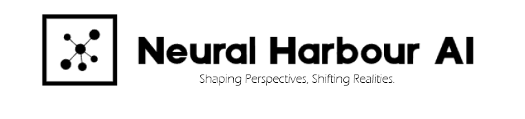

<!-- Improved compatibility of back to top link: See: https://github.com/othneildrew/Best-README-Template/pull/73 -->

<!--
*** Thanks for checking out the Best-README-Template. If you have a suggestion
*** that would make this better, please fork the repo and create a pull request
*** or simply open an issue with the tag "enhancement".
*** Don't forget to give the project a star!
*** Thanks again! Now go create something AMAZING! :D
-->

<!-- PROJECT LOGO -->
 

  

  <h3 align="center">NeuralHarbour AI</h3>

  

    Shaping Perspectives, Shifting Realities.
     
     

# Deprecated Branch
This branch is deprecated and no longer actively maintained. Instead Check out this new branch https://github.com/NeuralHarbour/LLM-Based-3D-Avatar-Assistant/tree/v2.0

